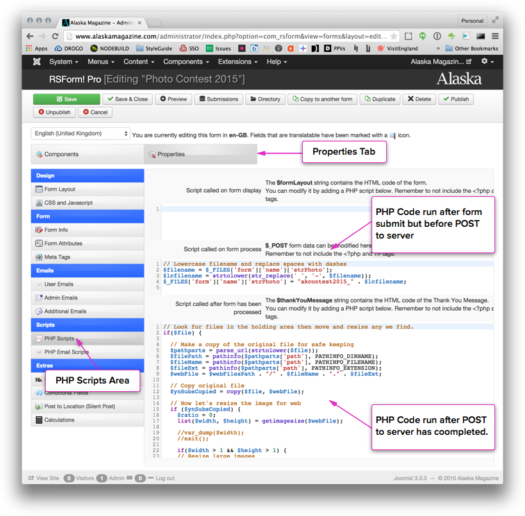

 
# Photo Contest Submission Configuration

**Components Used:**
* `com_rsform`
* `com_articles`
* `mod_zentools`

## Contest Submission
* Contestants enter the contest on the site using an RSForm (Photo Contest 2015). 
* An article is created for each submission and assign to the category '2015 Photo Contest Submissions' using the SQL Mapping feature of RSForms
    * The photograph submitted is added to the article as intro image. 
    * The caption submitted is added as the article title.
    * The category submitted is added to the article's Intro Text

### Managing File Upload Processes
1. From the admin, go to Components -> RSFormPro -> Photo Contest 2015
2. Click on the [Properties] tab
3. Click on PHP Scripts

The 'Script called on form process' section contains code that intercepts the file being submitted and renames it before it uploaded to the server

The 'Script called after form has been' section locates the file that has been uploaded and does the following:
1. Breaks the full path of the file in  path, file name and file estension
2. Copies the file to another directory
3. Gets the width and height of the copied file
4. If the file is larger than a demension size it scales and compresses it.
5. If the file is smaller than the set demensions, it just compresses it.
    

[photo-form-file-code.png](photo-form-file-code.png)

## Contest Submission Photo Gallery
* A Zentools module (2015 Alaska Magazine Photo Contest Submissions) is used to display all articles within the '2015 Photo Contest Submissions' category. 
* The module is set to display as a Grid and uses the article's Intro Image and Title when rendering the gallery.

##Contest Submission Voting

The voting requirement is accomplished using two parts:

1. A layout override for Zentools is used to display the photo gallery (`templates/yoo_theme/html/zentools/default.php`). 
2. An RSForm (Photo Contest 2015 Voting) is used to record the user's vote.

In the layout override, HTML and PHP were used to number each image in the gallery and assign each a custom class attribute. JavaScript was added to the 'Scripts' section of the voting form in the RSForm admin that grabs the gallery images number and some data in a 'data-text' attribute and injects it into two text input fields in the form. 

The user submits the form and we know which photo they voted on.
