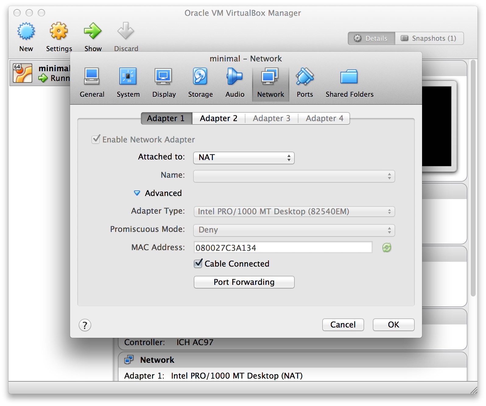
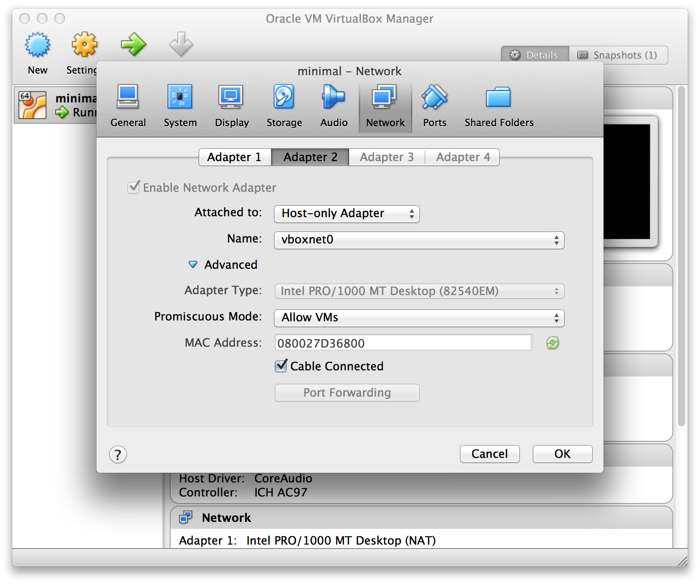
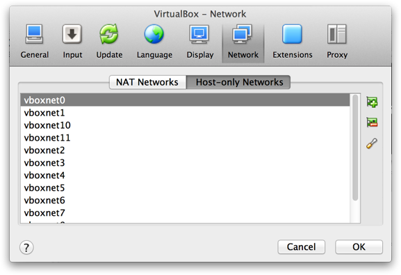
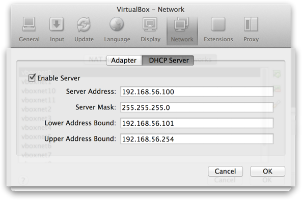
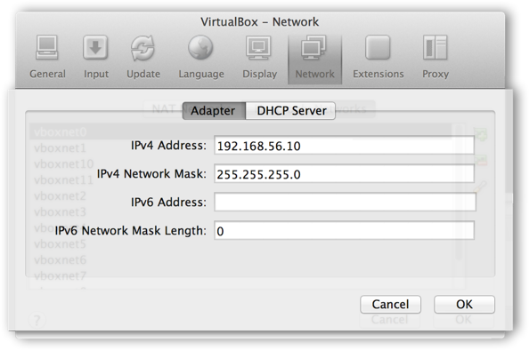

#Virtualbox Networking for an Ubuntu Local Development Machine on OS X

When creating a virtual machine on your host desktop for development purposes, you most likely want a configuration that provides HTTP access out from the guest machine and SSH access into it. We can accomplish this by setting up two network adapters. The first one will use [Network Address Translation (NAT),](https://www.virtualbox.org/manual/ch06.html#network_nat) which will be for our routing HTTP requests from the guest through the host machine and the second adapter will use a [Host-only adapter](https://www.virtualbox.org/manual/ch06.html#network_hostonly) to expose services, like ssh, on the guest to the host . This configuration is excels over methods like reverse tunneling in that it provides a means to negotiate a ssh connection with the guest while offline. We also avoid problems that can arise when hopping from one wireless network to another you can encounter with wi-fi dependent solutions.

##Features:
* Connect to the Internet from the virtual machine: **Yes**
* SSH into the virtual machine: **Yes**
* Manage connections between two virtual machines on the same host: **Yes**
* Connect to the virtual machine from outside the host: **No**

To get started, power off the virtual machine.

##Step 1: Configure the NAT Adapter
A network adapter with NAT enabled is configured by default when you create  new VM, so you most likely already have this set up but lets verify the configuration. In the Virtualbox client, click on the [ Network ] icon and then the [ Adapter 1 ] tab. It should look similar to the example. If not, go ahead and update your settings to match.

* **Attached To:**  "NAT"
* **Cable Connected:** True

**Click [ OK ]**



##Step 2: Configure the Host-Only Adapter
We need to first add a Host-only adapter so hit **[ ⌘ + , ]** or go to Virtualbox -> Preferences in the Virtualbox Menu Bar. Click the Network icon and then the Host-only Networks tab. Click the icon to add a new adapter and click **[ Save ]**.

Back in the Virtualbox client, click **[Settings -> Network]**,  then on the [ Adapter 2 ] tab and choose:

* **Attached To:**  "Host-only Adapter"
* **Name:** vboxnet0
* **Promiscuous Mode:** Allow VMs
* **Cable Connected:** True

**Click [ OK ]**



##Step 3: Configure Static Routes
Next we need to enable Virtualbox's built in DHCP server to manage a range of IP addresses for us and statically assign a few of them to various components needed for the Host-only configuration.

Close out of the Virtualbox network settings and hit **[ ⌘ + , ]** or go to Virtualbox -> Preferences in the Virtualbox Menu Bar. Click the Network icon and then the Host-only Networks tab. Next, Highlight 'vboxnet0', which is the network interface we just assigned our Host-only network adapter to, and edit its settings by clicking on the screwdriver icon in the far right-hand side of the window.



Once your in the configuration modal for the `vboxnet0` adapter, Start by going to the [DHCP Server] tab and make sure **Enable Server** is checked.  

The **Lower** and **Upper Address Bound** fields define a range of IP addresses to reserve for assigning statically. We want to set the DHCP **Server Address** to an IP that is in the same class but not part of the reserved ranged.  For this example, we set the **Server Address** to **\*.100** and the reserved range from **\*.101 - \*.254**. Later, we will assign an IP that is in this range to the guest machine.



 Move over to the [Adapter] tab. Here we set the Host-only adapter's IPv4 address to an IP in the same class as the others but still outside of the range that was reserved. I chose **\*.10** but you can choose anything  but **\*.1**.



##Step 4: Verify the Host Settings
Open up a terminal window and run `ifconfig`. You should see our Host-only adapter, named **vboxnet0** in the list with the IPv4 address you gave it.  (192.168.56.10 in the example)

```bash
jdoyle at squarepusher in ~
○ ifconfig

vboxnet0: flags=8943<UP,BROADCAST,RUNNING,PROMISC,SIMPLEX,MULTICAST> mtu 1500
	ether 0a:00:27:00:00:00
	inet 192.168.56.10 netmask 0xffffff00 broadcast 192.168.56.255
```

**So far we have:**
* Set up a NAT-based adapter
* Set up a Host-only-based adapter 
* Enabled the DHCP server
* Assigned an IP to the Host-only adapter named vboxnet0 (192.168.56.10)
* Assigned an IP to our DHCP server (192.168.56.100)
* Reserved a range of addresses we can statically assign to other services (192.168.56.101-254)

##Configure the Ubuntu Guest
We now need to configure Ubuntu to use the Host-only adapter in addition to the existing NAT adapter. 

Fire up the guest in Virtualbox. Once logged in, open the network interfaces configuration file.

```
sudo vim /etc/network/interfaces
``` 

You should see the existing configuration for `eth0`, which is the NAT-based adapter. Below that, add a new section for our host-only adapter name it `eth1`. This is where we use one of the static IP's we reserved earlier. In the example I use the first one in the range, 192.168.56.101. 

```bash
# The primary interface
auto eth0
iface eth0 inet dhcp

# The host-only interface
auto eth1
iface eth1 inet static
	address 192.168.56.101
	netmask 255.255.255.0
	network 192.168.56.0
	broadcast 192.168.56.255
```

To apply the settings, restart the networking service.

```bash
sudo service networking restart
```

##Update Existing Mounts
If you have any mounted drives, you will need to update their settings to match the IPv4 address we configured earlier in `/etc/fstabmounts `

##Verify Guest Settings
Now lets ssh into the guest from our host terminal and verify we can make outbound HTTP requests

```bash
jdoyle at squarepusher in ~
○ ssh jdoyle@192.168.56.102

Welcome to Ubuntu 14.10 (GNU/Linux 3.16.0-33-generic x86_64)
Last login: Thu Apr  9 22:14:05 2015

jdoyle@minimal ~ % ping google.com
PING google.com (216.58.219.78) 56(84) bytes of data.
64 bytes from mia07s24-in-f14.1e100.net (216.58.219.78): icmp_seq=1 ttl=63 time=28.9 ms
64 bytes from mia07s24-in-f14.1e100.net (216.58.219.78): icmp_seq=2 ttl=63 time=28.9 ms
64 bytes from mia07s24-in-f14.1e100.net (216.58.219.78): icmp_seq=3 ttl=63 time=29.5 ms
```

##Streamline the Management
###Starting the guest as a headless server
Now that you can SSH into the guest, why mess with the Virtualbox client app. Simply launch a headless instance from you terminal anytime yo need to fire it up.

```bash
vboxmanage startvm minimal --type headless &
```

----

###Calling the guest by name
We can refer to the guest by name instead of IP by adding a record in the host's host file.

```bash
192.168.56.101 minimal
```

You can do the same for the host in the guest's host file. should you care to


```bash
192.168.56.10 squarepusher
```

##Troubleshooting

###eth0 error When using a cloned VM
After attaching new cloned vdi file and after starting vm, the ethernet interface show error message:

`Cannot find device "eth0"`
`Failed to bring up eth0`

The above error was solved by using the command:

```bash
sudo rm -rf /etc/udev/rules.d/70-persistent-net.rules

sudo reboot
```

