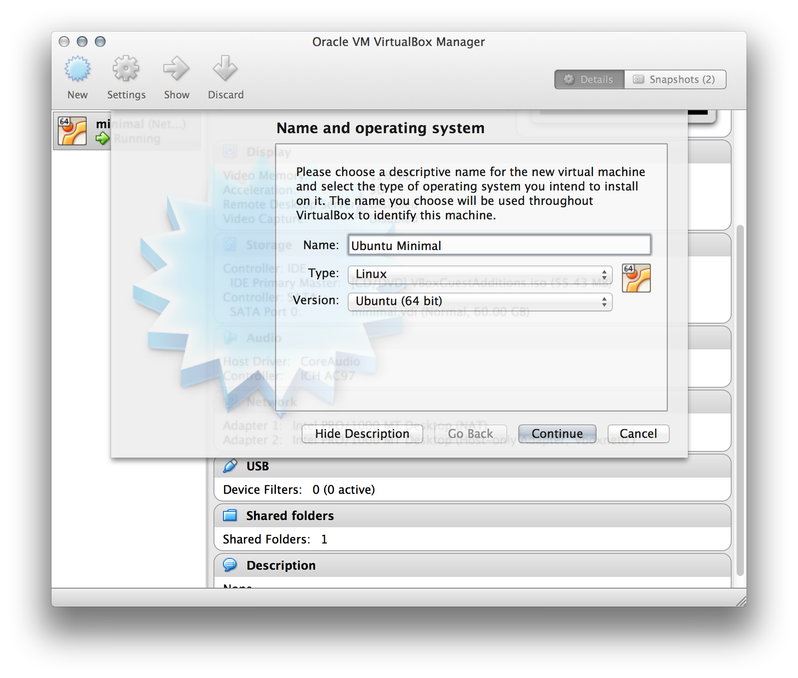
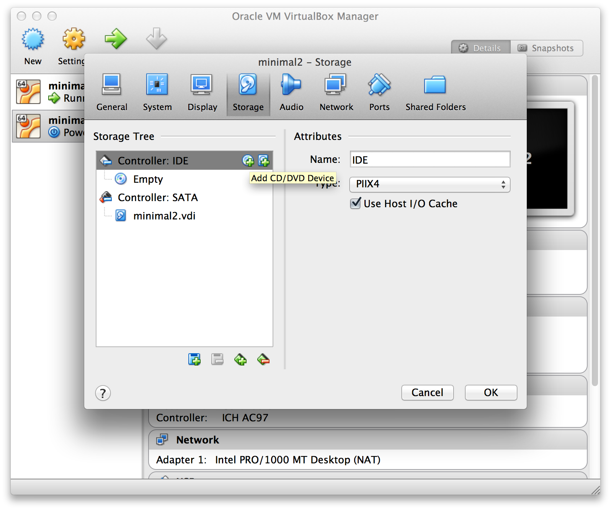
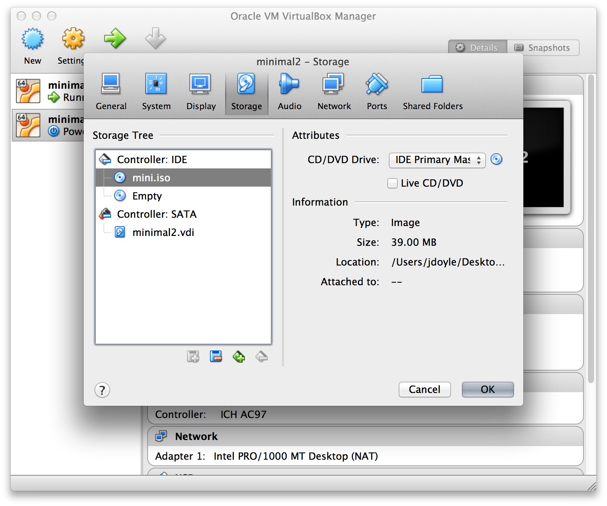

#Virtualbox Setup Guide for an Ubuntu Local Development Machine on OS X

This article covers the initial installation of Ubuntu Minimal for running a headless deevelopment environment on Virtualbox. 

##Part 1: Install Ubuntu Minimal
Grab the ISO here: [Ubuntu Minimal 64-bit](https://help.ubuntu.com/community/Installation/MinimalCD#A64-bit_PC_.28amd64.2C_x86_64.29)

**Step 1:** Create a new virtual machine with dynamically allocated storage



**Step 2:** In the Virtualbox client, highlight your new guest and then go to **Settings -> Storage**. Then highlight the Controller and click on the CD icon to add a new device.



**Step 4:** Choose the ISO you downloaded and attach it.



**Step 5:** Now fire up the guest and follow the installation steps. Once complete, eject the mini.iso and restart the guest.


##Part 2: Install Guest Additions

**Step 1:**  With the guest powered on, Select the guest in the Virtualbox manager and select **Devices -> Insert Guest Additions CD...** from the menu bar to attach it.

**Step 2:**  We need to boot the guest into the root shell so power off the machine and then start it back up from the Virtualbox Manager and hold down the **[ shift ]** as soon as the console window appears.

**Step 3:** Select Advanced and then Recovery Mode form the options and the machine will boot into the Grub menu. 

**Step 4:** To actually boot into the root shell you first have to select Network and let it remount your drive. Then select Root and it will drop you into the root shell

**Step 5:** cd into `/etc/mnt` and see if VBoxLinuxAdditions.run is in there. If so, just run it. If not, first mount the disk and then run it.

```bash
mount /dev/cdrom /mnt   
cd /mnt
./VBoxLinuxAdditions.run
sudo poweroff now
```

Before we move forward, we need to install and configure SSH, if it isn't already


##Part 3: Configure SSH
Before we can ssh into the guest, we need to have SSH! Launch the terminal window for the guest from Virtualbox and login. Use `apt-get` to install OpenSSH

```bash
sudo apt-get update
sudo apt-get install openssh-server
```

Now that you can ssh into the guest, you will want to add your host's public key to the list of authorized keys

```
cat ~/.ssh/id_rsa.pub | ssh jdoyle@192.168.56.101 'cat >> .ssh/authorized_keys'
```

At this point you should be ready to set up the networking on the guest in a configuration that allows for outgoing HTTP requests and inbound SSH connections. You can stay on this page and install some of the tweaks or jump straight to the networking guide.

 [Jump to the networking guide](virtualbox-networking.md).
 
## Toubleshooting

### Manualling Adding Route
If you cannot ssh or ping the guest but you can arping it, you might try manually adding the vboxnet0 route on the host. 

**NOTE:** Simply running this command will not persist after a reboot.

```bash
sudo route -nv add -net 192.168.56 -interface vboxnet0
```

**NOTE:**If you have a VPN like Cisco AnyConnect, be sure to disable it before running this command as it will prevent you from adding the static route.
