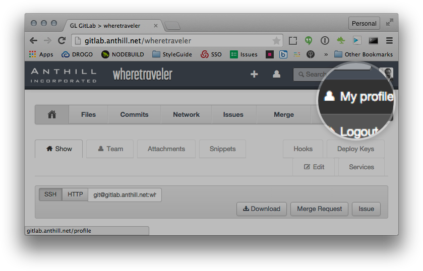
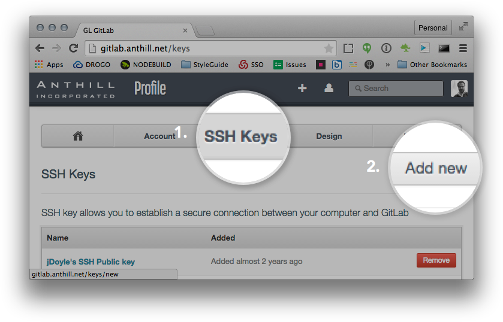
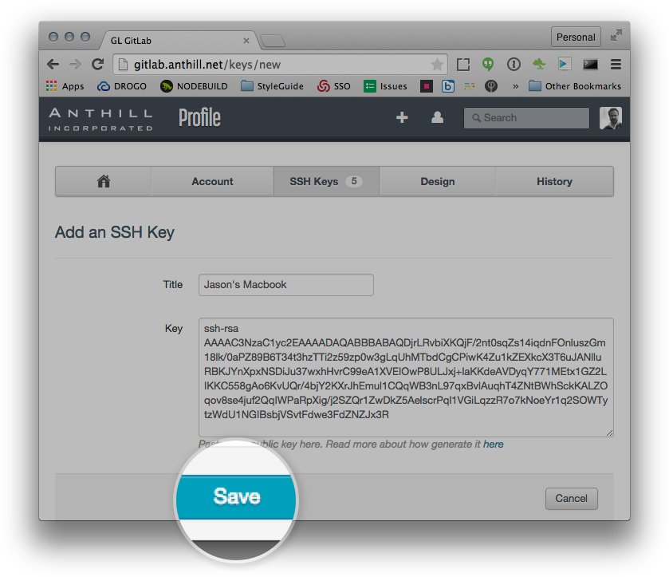

#Configuring Git for Morris Media Network Projects

##Local Git Config
###Step 1: Add user name and email to Git config
Make sure you have set your name and email in your local Git's config file. To check:

```bash
git config -l
user.email=johndoe@example.com
user.name=John Doe
push.default=simple
```

If you are missing the `user.name` and/or `user.email`, you can add them using these command:

```bash
git config --global user.name "John Doe"
git config --global user.email johndoe@example.com
```

----

##Creating and Adding Public Keys to Gitlab

###Step 1: Check for SSH keys

* First, we need to check for existing SSH keys on your computer. Open Terminal and enter:

```bash
ls -al ~/.ssh
```

Check the directory listing to see if you already have a public SSH key. By default, the filename of the public keys will be  `id_rsa.pub`. If so, skip to step 4.

###Step 2: Generate a new SSH key
**NOTE: DO NOT ENTER A PASSPHRASE WHEN PROMTPED. LEAVE EMPTY**
If you determined you do not already have a public key, you can generate a new one using the following command and accepting the defaults presented:

```bash
ssh-keygen -t rsa -C "your_email@example.com"
```

###Step 3: Add your key to the ssh-agent
To configure the ssh-agent program to use the SSH key you've generated:

* Ensure ssh-agent is enabled by verifying the following command returns an agent id:

```bash
eval "$(ssh-agent -s)"
```

* Add your generated SSH key to the ssh-agent:

```bash
ssh-add ~/.ssh/id_rsa
```

###Step 4: Copy your SSH key
* Print your key to the terminal and copy it.

```bash
cat ~/.ssh/id_rsa.pub
```

###Step 5: Add your SSH key to your Gitlab account
* Log into [http://gitlab.anthill.net](http://gitlab.anthill.net)
* Click on **[My Profile]**


* From your profile, click the **[SSH Keys]** tab and choose **[Add New]**


* Give your new key a title and paste in your key


* Click **[Save]**


